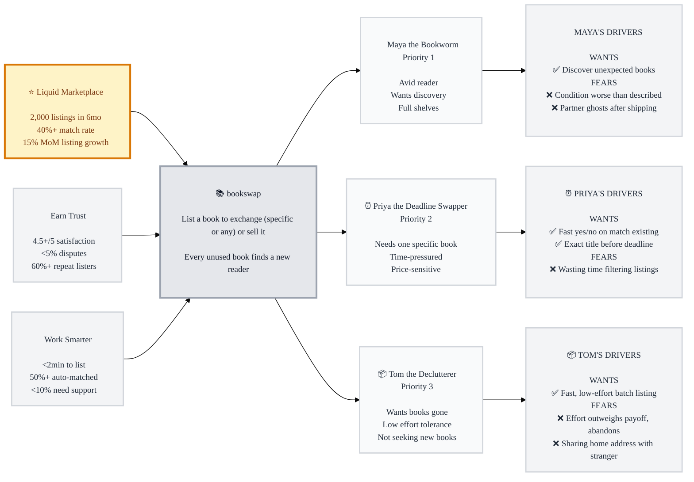

# Trigger Map: bookswap

> Visual overview connecting business goals to user psychology

**Created:** 2026-07-12
**Author:** Radi
**Methodology:** Based on Effect Mapping (Balic & Domingues), adapted for WDS framework (Trigger Mapping — solution-free, includes negative driving forces)

---

## How to Read This

This map connects **why the business exists** (Business Goals) through **what we're building** (bookswap) to **who uses it** (Target Groups) and **what drives their behavior** (Driving Forces — both wants and fears). No solutions or features live here on purpose — see `feature-impact-analysis.md` for how these forces translate into what to build.

---

## Strategic Documents

- **This file** — visual overview and navigation
- **`personas/avid-reader.md`** — Maya the Bookworm (Priority 1)
- **`personas/specific-need-swapper.md`** — Priya the Deadline Swapper (Priority 2)
- **`personas/declutterer.md`** — Tom the Declutterer (Priority 3)
- **`feature-impact-analysis.md`** — prioritized driving forces (Frequency × Intensity × Fit) and what they imply for the build

---

## Vision

Every unused book finds a new reader — quickly, easily, and without friction.

---

## Business Objectives

### ⭐ Goal 1 (Primary): Build a self-sustaining, liquid marketplace
Everything else depends on having enough listings and matches flowing that the platform feels "alive."
- **1.1** Reach 2,000 active listings within 6 months of launch
- **1.2** 40%+ of listings result in a completed swap/sale within 30 days
- **1.3** 15% month-over-month growth in new listings for the first 6 months

### 🚀 Goal 2 (Prerequisite): Earn trust — get happier, repeat users
P2P exchange lives or dies on trust; a bad first swap kills retention.
- **2.1** Maintain 4.5+/5 average post-exchange satisfaction rating
- **2.2** Keep dispute/no-show rate under 5% of completed exchanges
- **2.3** 60%+ of users list a second book within 90 days of their first

### 🌟 Goal 3 (Prerequisite): Work smarter — minimize friction and overhead
Directly reflects the brief's stated design goals: low-friction listing, quick matching.
- **3.1** Median time-to-list under 2 minutes
- **3.2** 50%+ of successful matches originate from automated suggestions, not manual search
- **3.3** Fewer than 10% of transactions require manual support intervention

*Note: these are inferred targets (the Product Brief didn't specify numbers) — shaped by domain research on P2P/swap marketplaces, not yet validated against real data. Revisit once you have usage data.*

---

## Target Groups (Prioritized)

### 1. Maya the Bookworm — *Priority 1*
> Reads constantly, shelves are full, buying new isn't sustainable. Loves the "treasure hunt" of an unexpected find. Identity tied to being well-read.

**Top drivers:** ❌ Fears receiving a book in worse condition than described · ✅ Wants to discover unexpected books · ❌ Fears a swap partner ghosting after she's already shipped

### 2. Priya the Deadline Swapper — *Priority 2*
> Wants one particular book — a textbook, a book-club pick, the next in a series — and wants it now, cheaply. Time-pressured, price-sensitive, low patience for browsing.

**Top drivers:** ✅ Wants a fast yes/no on whether a match exists · ✅ Wants the exact title before her deadline · ❌ Frustrated filtering irrelevant listings to find one title

### 3. Tom the Declutterer — *Priority 3*
> A pile of books taking up space, wants them gone with minimal effort. Not necessarily seeking books in return. Motivated by guilt-relief and reclaiming space.

**Top drivers:** ❌ Fears the listing effort outweighs the payoff and abandons mid-flow · ✅ Wants to get rid of books fast with almost no effort · ❌ Fears sharing his home address with a stranger

---

## Trigger Map Visualization

*(Diagram shows each persona's top 3 highest-scored drivers. Full 6 wants+fears per persona are in the individual persona docs.)*

---

## Design Focus Statement

**bookswap must feel effortless to list on and safe to transact through — the two failure modes that kill P2P marketplaces are listing abandonment and trust breakdown, and both showed up as top-scored forces across every persona.**

**Primary Design Target:** Tom the Declutterer — he's the supply engine (no listings, no marketplace), and his abandonment fear scored the single highest force (15/15) of any persona.

**Must Address (HIGH priority, 14–15):**
1. Tom's fear that listing effort outweighs payoff → **ultra-low-friction, batchable listing flow**
2. Tom's want for fast, low-effort listing → same flow, optimized for speed (target: under 2 min)
3. Priya's want for a fast yes/no on whether a match exists → **instant search + "notify me" fallback**

**Should Address (recurring MEDIUM cluster, 11–13 — a cross-cutting trust theme, not one single feature):**
1. Condition disputes (Maya) → condition photos/ratings at listing time
2. Partner ghosting / non-delivery (Maya, Priya) → delivery confirmation, reputation signals
3. Address-privacy fear (Tom) → address masking or platform-mediated shipping
4. Deadline risk (Priya) → urgency signals, waitlist/notify-when-available
5. Search friction for specific titles (Priya) → strong search/filter, not just browse

---

## Cross-Group Patterns

### Shared Drivers
Trust and reliability concerns appear in **every persona's fear list** (condition mismatch, ghosting/no-delivery, address privacy) despite none individually scoring HIGH — this is the clearest signal in the data. A trust & safety layer is table-stakes, not optional polish.

### Unique Drivers
- Maya is the only persona driven by *discovery* (serendipity, "open to any book") — this only matters for the exchange-for-any path.
- Priya is the only persona under *time pressure* — she may abandon to a paid alternative (buy new) if matching is too slow.
- Tom is the only persona who may not want a book back at all — the sale path exists primarily for him.

### Potential Tensions
- Tom (low effort, wants gone fast) vs. Maya (wants rich discovery/browsing) pull the listing/browse UX in different directions — Tom needs speed, Maya needs texture. Likely resolved by keeping *listing* minimal (serves Tom) while investing browse/discovery UX separately (serves Maya) rather than conflating the two flows.

---

## Next Steps

- [ ] **Review this Trigger Map** — validate personas and priorities feel right before design work builds on them
- [ ] **Use for Feature Prioritization** — see `feature-impact-analysis.md`
- [ ] **Guide Phase 3: UX Scenarios** — each scenario should map to a persona + a specific driving force
- [ ] **Validate with real users** — these are inferred from domain research, not user interviews; revisit after early usage/feedback

---

_Generated with Whiteport Design Studio framework — Suggest mode, reviewed step-by-step with Radi_
_Trigger Mapping methodology credits: Effect Mapping by Mijo Balic & Ingrid Domingues (inUse), adapted with negative driving forces_
